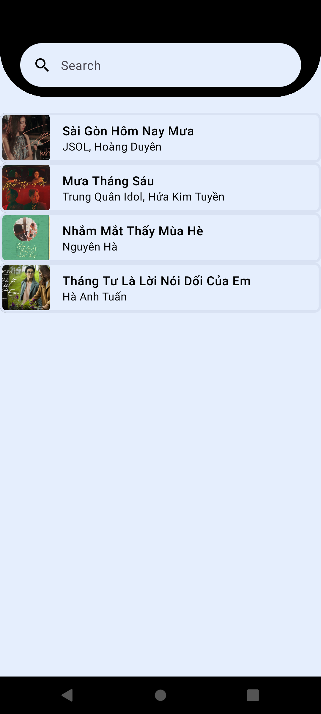
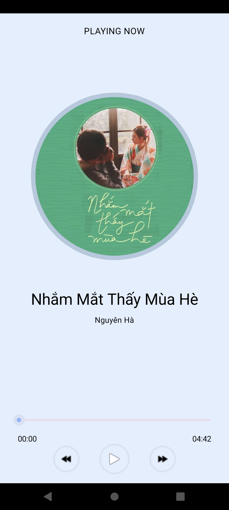

# 🎵 MediaPlayerDev App
A simple Android music player built with Kotlin and Jetpack Compose. Music tracks are loaded from Firebase, and played using Media3 (ExoPlayer)
## Features
- Stream music from Firebase.

- Modern UI with Compose.

- Smooth playback with Media3.

## Tech Stack
- Jetpack Compose.

- MVVM architecture.

- Dagger-hilt.
  
- Media3 (ExoPlayer).

## Screenshots

  
  

## Getting Started
1. Clone the repository

2. Set up Firebase in your project (add google-services.json)

3. Configure your Firebase Database with your music track list

4. Build and run the app
